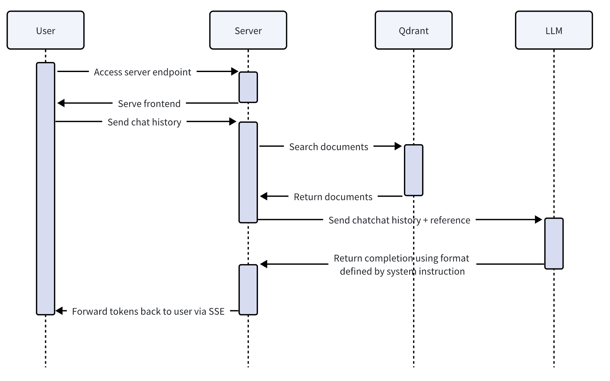

# RAG Based Research Assistant
**A Full-Stack Retrieval-Augmented Generation Application with Streaming Responses and Source Verification**

**Author:** Nahai Gu
**Email:** gu.nah@northeastern.edu

---

## Project Summary

This project presents a full-stack Retrieval-Augmented Generation (RAG) chat system that streams responses with citations in real time. The system combines a Python Starlette backend with Server-Sent Events (SSE), Qdrant vector database, FastEmbed for embeddings, and dual LLM support (local Ollama Gemma3:4b and cloud-based Gemini-2.5-flash). The React + Vite frontend renders streaming text with inline citation markers and reference cards, enabling users to verify claims against source documents. The system demonstrates trustworthy, citation-backed responses on technical and academic topics with a reproducible pipeline.

---

## Project Motivation

The goal of this project is to provide trustworthy, citation-backed responses on technical and academic topics to help students and researchers better understand custom-selected literature efficiently. The knowledge domain focuses on academic books, but the same approach can be applied to other materials and domains such as research papers, scholarly articles, and technical documents.

The system provides a reproducible pipeline for RAG document generation and UI that lets users quickly verify claims via inline citations tied to source snippets. This allows students and researchers to efficiently navigate through hundreds of pages of materials and quickly find documents that are most related to the research questions or conjectures.

---

## Project Architecture

This project builds on the existing RAG pipeline paradigm with enhanced output stream for better UI responsiveness.

- **Standard RAG Pipeline**: The system follows the established pattern of chunking → embedding → vector search → prompt assembly → streaming generation.
- **Vector Database**: Qdrant with cosine distance and payload indexing for `title` and `author` fields enables efficient similarity search and metadata filtering.
- **Embedding Model**: FastEmbed `bge-small-en-v1.5` with an async, batched executor provides efficient document embedding with 384-dimensional vectors.
- **LLM Providers**: Ollama provider provides fully local deployed LLM service with robust streaming and error handling. Meanwhile, Gemini is also wired as an optional fallback alternative in case local computational resources are limited.
- **SSE Streaming**: Server-Sent Events (SSE) deliver real-time responses to the client with structured event types: `reference`, `text`, `error`, and `done`.


*Figure 1: User Request Timeline*

---

## Data Sources

PDF knowledge sources are stored under `rag/input`. These sources provide 13,168 document snippets for retrieval.

1. D. P. Bovet and M. Cesati, *Understanding the Linux Kernel*, 3rd ed., O'Reilly Media, 2005. [Link](https://www.cs.utexas.edu/~rossbach/cs380p/papers/ulk3.pdf)

2. G. Coulouris, J. Dollimore, T. Kindberg, and G. Blair, *Distributed Systems: Concepts and Design*, 5th ed., Pearson (Addison-Wesley), 2011. [Link](https://ftp.utcluj.ro/pub/users/civan/CPD/3.RESURSE/6.Book_2012_Distributed%20systems%20_Couloris.pdf)

3. A. D. Kshemkalyani and M. Singhal, *Distributed Computing: Principles, Algorithms, and Systems*, Cambridge University Press, 2011. [Link](https://eclass.uoa.gr/modules/document/file.php/D245/2015/DistrComp.pdf)

4. J. M. Applefield, R. Huber, and M. Moallem, "Constructivism in Theory and Practice: Toward a Better Understanding," *The High School Journal*, vol. 84, no. 2, pp. 35–53, 2001. [Link](https://people.uncw.edu/huberr/constructivism.pdf)

5. M. B. Steger, *Globalization: Past, Present, Future*, University of California Press, 2023. [Link](https://webfiles.ucpress.edu/oa/9780520395770_WEB.pdf)

---

## Knowledge Injection

### PDF Data Parsing

PDF knowledge sources are parsed line by line using `rag/parser.py` to produce overlapping documents used for RAG. Each document consists of:

- **title**: The document title
- **author**: The document author
- **pages**: The page number
- **lines**: The starting line number of the snippet
- **content**: The actual text content of the snippet

### Embedding and Indexing

FastEmbed from Qdrant is used to embed the document `content` into dense vectors for cosine similarity search. The parsing pipeline (`rag/parser.py`) implements several key components:

- **Page cleanup**: Custom page cleanup functions choose the first content line after N newlines, with specialized handlers for each source type (Linux, Constructivism, Globalization).
- **Line processing**: Lines are trimmed and collected; snippets use configurable `snippet_size` and `snippet_overlap` parameters to form overlapping context windows.
- **Output artifacts**: Per-document outputs include `pages_*.jsonl`, `lines_*.jsonl`, and `snippets_*.jsonl`; all snippets are consolidated into `rag/output/total_snippets.jsonl`.

> **NOTE:** It could take more than **30 mins** to upload all documents to Qdrant collection at server start. This only needs to be done once when the server runs for the first time. Due to hardware constraints, pictures, figures and tables are omitted during parsing.

---

## Knowledge Retrieval

The retrieval pipeline implements:

- **Query Embedding**: User messages are embedded and searched in Qdrant with configurable top-K and similarity threshold parameters.
- **Reference Streaming**: References stream first to the client before LLM generation begins.
- **Conditional Prompting**: System prompt is assembled conditionally based on whether relevant references exist.
- **Token Streaming**: The LLM provider streams tokens as SSE `text` events; completion emits `done`.

Prompt engineering is crucial to make sure the model behavior is expected. Meanwhile, the model's capability to consume large contextual information and to strictly follow system instructions also impact service speed and precision.

---

## Repository and Reproducibility

The project repository contains complete instructions for replication:

- **Dockerization**: Qdrant runs via Docker:
```bash
  docker run -p 6333:6333 -p 6334:6334 qdrant/qdrant
```

- **Python Dependencies**: Declared in `pyproject.toml`; install via:
```bash
  uv sync
  # or
  pip install httpx pymupdf starlette tqdm uvicorn qdrant-client fastembed python-dotenv
```

- **Frontend Dependencies**:
```bash
  cd frontend && npm install
```

- **Environment Configuration**: Set `GEMINI_API_KEY` in `.env`

- **Knowledge Base Build**: Run `python rag/parser.py` to parse sources

- **Server Startup**: Run `python server.py` (default: host `0.0.0.0`, port `5500`)

---

## Performance Analysis

The combined corpus produces 13,168 document snippets after parsing and chunking, providing sufficient scale for meaningful retrieval experiments.

### Model Comparison

- Preliminary testing shows that Gemini model outperforms Ollama model in response speed and precision.
- In comparison, Gemini understands better system prompt and produces less hallucination in RAG mode even though the model is not locally deployed.

### Verifiability

- **Reproducible Documents**: All claims are tied to specific source snippets with page and line reference. All documents can be reproduced using `parser.py`.
- **Reference Cards Verification**: Users view the original source text on reference cards to verify model's claim.
- **Confidence Signaling**: When no relevant references are found, the system signals low confidence rather than generating unsupported claims.

> **NOTE:** Better model seems to have better performance. A more capable model does not seem to produce more hallucination because it can better understand and follow the system prompt.

### API Streaming Protocol

The SSE endpoint (`POST /api/chat/stream`) accepts:

| Parameter | Type | Description |
|-----------|------|-------------|
| `messages` | Array | Array of `{role, content}` objects |
| `provider` | String | `gemini` or `ollama` |
| `rag_mode` | Boolean | Enable/disable RAG |
| `topk` | Integer | Retrieval count |
| `threshold` | Float | Similarity cutoff |

Response events include:

| Event | Data |
|-------|------|
| `reference` | `{"content": [Reference...]}` |
| `text` | `{"content": "...partial text..."}` |
| `error` | `{"content": "message"}` |
| `done` | `{}` |

---

## Conclusions

This project demonstrates a complete, reproducible RAG system with streaming UX and citation fidelity. Key achievements include:

- Real-time streaming responses with inline citation markers
- Verifiable claims tied to source documents with page-level granularity
- Configurable retrieval parameters for precision-recall tuning
- Dual LLM support (local and cloud) for flexible deployment

### Future Work

Potential extensions include:

- **Expanded Data Sources**: Integrate additional academic databases, research papers, and technical documentation.
- **Citation Ranking**: Add ranking beyond similarity scores to prioritize authoritative sources.
- **Confidence Calibration**: Implement calibrated confidence scores to suppress low-certainty claims automatically.
- **Multi-modal Support**: Extend parsing to handle figures, tables, and other non-text content.
- **Datastore Optimization**: Using database sharding and true concurrent (currently Python co-routines) writers to speed up write operations.
- **Embedding Model Optimization**: Using multiple embedding model instances to divide workload for faster database write.

### Notes

- Knowledge base rebuilds automatically if counts differ from `total_documents_count` to avoid stale indexes.
- Ensure local PDFs exist under `rag/input`. If you add new sources, update `documents` in `rag/parser.py` accordingly.
- Keep `.env` for secrets; avoid committing API keys.
- Use customized, smaller document samples for testing.

## Running Instructions (localhost)
1. Start Qdrant server:
```bash
  docker run -p 6333:6333 -p 6334:6334 qdrant/qdrant
```
2. Install Python dependencies:
```bash
  uv sync
  # or
  pip install httpx pymupdf starlette tqdm uvicorn qdrant-client fastembed python-dotenv
```
3. Install frontend dependencies and build frontend:
```bash
  cd frontend && npm install
  npm run build
```
4. Set `GEMINI_API_KEY` in `.env`
5. Build knowledge base:
```bash
  python rag/parser.py
```
6. Start server:
```bash
  python server.py
```
7. Access the application:
   - Open your browser and navigate to `http://localhost:5500`
